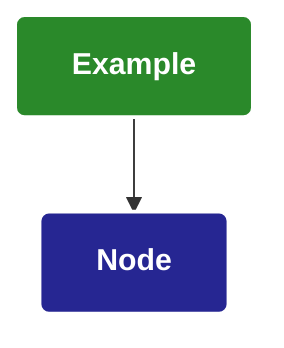

# Mermaid Diagram Styling

## Visual Style Guidelines

- Use a dark color palette for backgrounds
- Apply consistent styling across all diagram nodes
- Use bold white text and borders for all nodes
- Use rounded corners for a modern appearance
- Use background colors that make sense for node purpose (red = fail, green = success)

## Example Diagram

## Example Color Palette

- Success Green: #2A892A
- Purple: #8714D4
- Dark Blue: #262692
- Bright Orange: #DB4A15
- Deep Red: #CA1717
