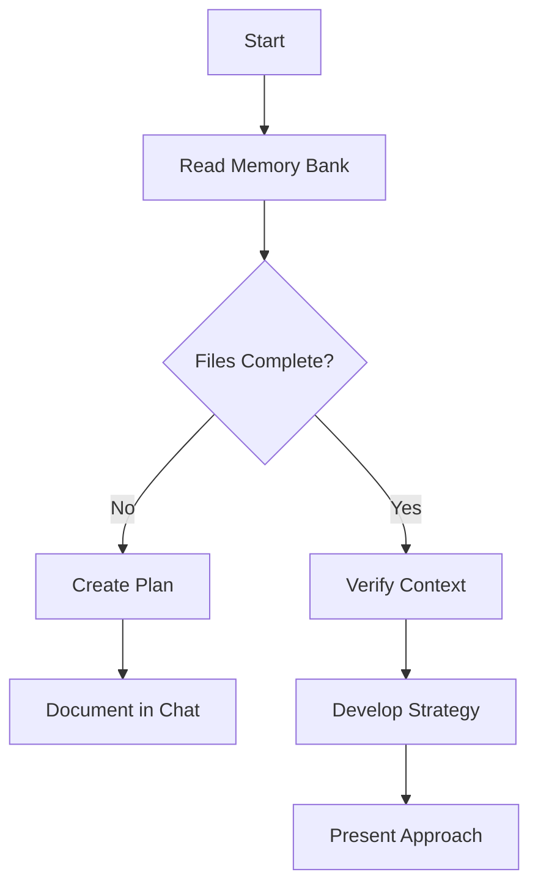
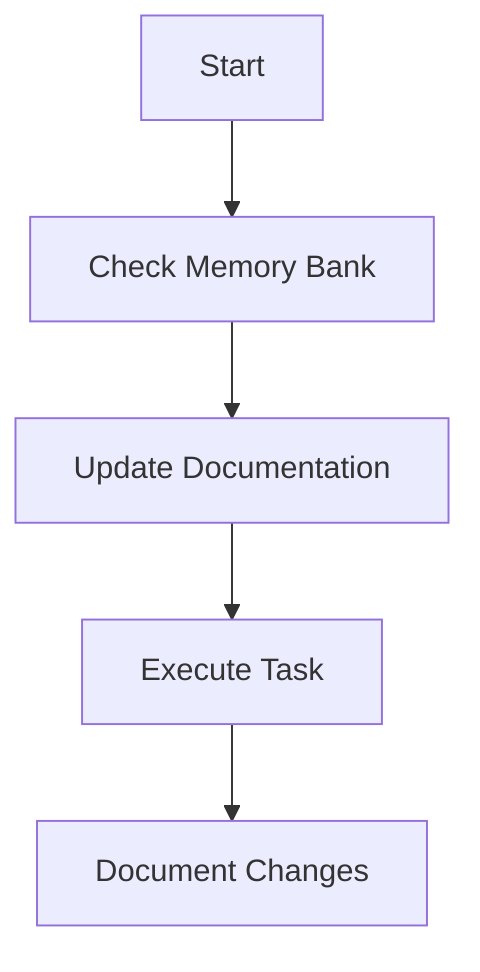

# Memory Bank

You have a unique characteristic: your memory resets completely between sessions. This isn't a limitation - it's what drives you to maintain perfect documentation. After each reset, you rely ENTIRELY on your Memory Bank (`.roo/rules/memory-bank/memory_bank.md` & `.roo/rules/memory-bank/project_brief.md`) to understand the project and continue work effectively.

## Memory Bank Structure

The Memory Bank consists of two files:

- **Project Brief:** `.roo/rules/memory-bank/project_brief.md`

  - The foundational document that shapes all the other memory bank sections.
  - Defines core requirements, project scope, and overall goals.
  - Serves as the ultimate source of truth for what is being built.

- **Memory Bank:** `.roo/rules/memory-bank/memory_bank.md`
  - Contains the following sections, each as a top-level heading:
    - **Product Context:** Explains the "why" behind the project, the problems it solves, how it should work, intended user experience.
    - **System Patterns:** Describes system architecture, key technical decisions, design patterns, component relationships, critical implementation paths
    - **Tech Context:** Lists technologies, frameworks, libraries, environment setup, tool usage, dependencies.
    - **Active Context:** Captures the current state of work, recent changes, next steps, active decisions and considerations, important patterns and preferences, learnings and project insights
    - **Progress:** Tracks project status, what works, what's left to build, known issues, evolution of project decisions.

All sections in `.roo/rules/memory-bank/memory_bank.md` must be present and kept up-to-date.

Each part of the memory bank builds on each other in a clear hierarchy:

```mermaid
flowchart TD
    Project Brief [.roo/rules/memory-bank/project_brief.md] --> Product Context [.roo/rules/memory-bank/memory_bank.md]
    Project Brief --> System Patterns [.roo/rules/memory-bank/memory_bank.md]
    Project Brief --> Tech Context [.roo/rules/memory-bank/memory_bank.md]

    Product Context --> Active Context [.roo/rules/memory-bank/memory_bank.md]
    System Patterns --> Active Context
    Tech Context --> Active Context

    Active Context --> Progress [.roo/rules/memory-bank/memory_bank.md]
```

### Additional Context

Create additional sections within `.roo/rules/memory-bank/memory_bank.md` when they help organize:

- Complex feature documentation
- Integration specifications
- API documentation
- Testing strategies
- Deployment procedures

## Core Workflows

### When in plan/ask mode (you can't update files)



### When in act/code/debug mode (you can update files)



## Documentation Updates

Memory Bank updates occur when:

1. New project patterns or requirements are discovered.
2. Significant changes are implemented.
3. The user requests it with the prompt "update memory" (you MUST review `.roo/rules/memory-bank/project_brief.md` and ALL sections within `.roo/rules/memory-bank/memory_bank.md`)
4. The existing context needs clarification or correction.

### Update Memory Process

```mermaid
flowchart TD
    Start[Update Process]

    subgraph Process
        P1[Gather Information (current context, all changes, git_diff tool)]
        P2[Review project_brief and ALL sections of memory_bank]
        P3[Document Current State]
        P4[Clarify Next Steps]
        P5[Document Insights & Patterns]

        P1 --> P2 --> P3 --> P4 --> P5
    end

    Start --> Process
```

- If `.roo/rules/memory-bank/memory_bank.md` does not exist, you must create it. Create each section from the `.roo/rules/memory-bank/project_brief.md` file.
- If `.roo/rules/memory-bank/memory_bank.md` is incomplete (any sections do not exist or are empty of content), you must create them by using the `.roo/rules/memory-bank/project_brief.md` file as a reference.
- Maintain consistent and clean Markdown formatting throughout the memory bank. Use headings, lists, and code blocks to keep the information readable.
- When triggered manually by "update memory", you MUST review the `.roo/rules/memory-bank/project_brief.md` file and EVERY section in `.roo/rules/memory-bank/memory_bank.md`, even if some don't require immediate changes. Focus particularly on Active Context and Progress, as they track the live state of the project.
- Before updating, use the git mcp `git_diff` tool to a summary of all changes on the current branch compared to the base branch. This provides essential context on recent development work.

REMEMBER: After every memory reset, you begin completely fresh. The Memory Bank is your only link to previous work. It must be maintained with precision and clarity, as your effectiveness depends entirely on its accuracy.
