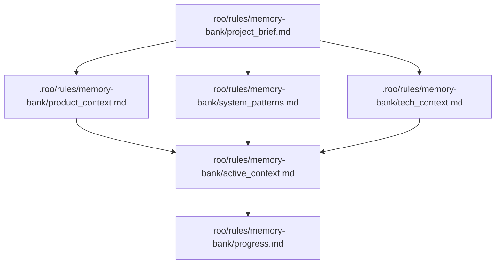
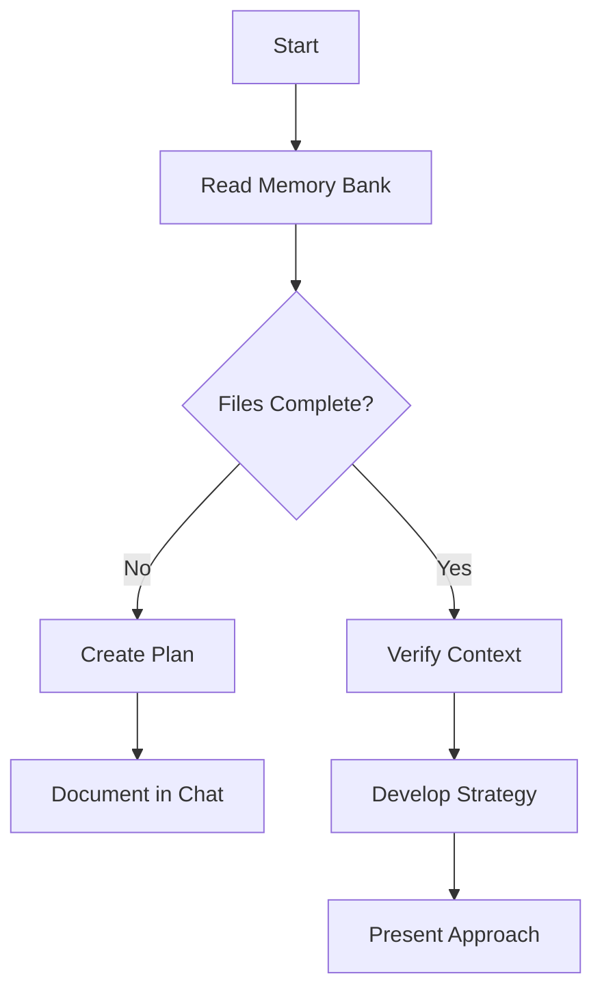
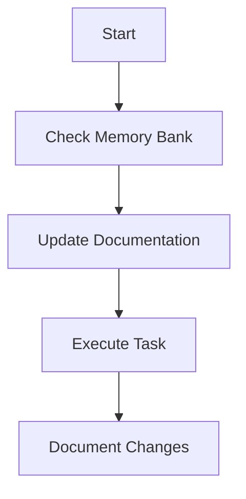

# Memory Bank

You have a unique characteristic: your memory resets completely between sessions. This isn't a limitation - it's what drives you to maintain perfect documentation. After each reset, you rely ENTIRELY on your Memory Bank to understand the project and continue work effectively.

## Memory Bank Structure

The Memory Bank consists of core files and optional context files, all in Markdown format. Files build upon each other in a clear hierarchy:



### Core Files (Required)

1. `.roo/rules/memory-bank/project_brief.md`

   - Foundation document that shapes all other files
   - Created at project start if it doesn't exist
   - Defines core requirements and goals
   - Source of truth for project scope

2. `.roo/rules/memory-bank/product_context.md`

   - Why this project exists
   - Problems it solves
   - How it should work
   - User experience goals

3. `.roo/rules/memory-bank/active_context.md`

   - Current work focus
   - Recent changes
   - Next steps
   - Active decisions and considerations
   - Important patterns and preferences
   - Learnings and project insights

4. `.roo/rules/memory-bank/system_patterns.md`

   - System architecture
   - Key technical decisions
   - Design patterns in use
   - Component relationships
   - Critical implementation paths

5. `.roo/rules/memory-bank/tech_context.md`

   - Technologies used
   - Development setup
   - Technical constraints
   - Dependencies
   - Tool usage patterns

6. `.roo/rules/memory-bank/progress.md`
   - What works
   - What's left to build
   - Current status
   - Known issues
   - Evolution of project decisions

### Additional Context

Create additional files/folders within `.roo/rules/memory-bank/` when they help organize:

- Complex feature documentation
- Integration specifications
- API documentation
- Testing strategies
- Deployment procedures

## Core Workflows

### When in plan/ask mode (you can't update files)



### When in act/code/debug mode (you can update files)



## Documentation Updates

Memory Bank updates occur when:

1. Discovering new project patterns
2. After implementing significant changes
3. When user requests with **update memory** (MUST review ALL memory files)
4. When context needs clarification

### Update Memory Process

```mermaid
flowchart TD
    Start[Update Process]

    subgraph Process
        P1[Gather Information (current context, all changes, git_diff tool)]
        P2[Review ALL Memory Files]
        P3[Document Current State]
        P4[Clarify Next Steps]
        P5[Document Insights & Patterns]

        P1 --> P2 --> P3 --> P4 --> P5
    end

    Start --> Process
```

- If the required memory files don't exist yet then create them
- Maintain consistent and clean Markdown formatting throughout the memory bank. Use headings, lists, and code blocks to keep the information readable.
- When triggered manually by **update memory**, you MUST review every memory bank file, even if some don't require updates. Focus particularly on active_context.md and progress.md as they track current state.
- Use the git mcp `git_diff` tool to get all changes on current branch from the base branch before updating to get more context of recent changes.

REMEMBER: After every memory reset, you begin completely fresh. The Memory Bank is your only link to previous work. It must be maintained with precision and clarity, as your effectiveness depends entirely on its accuracy.
